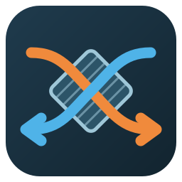

# Aldes InspirAIR Top (Modbus) — Home Assistant integration

[](https://www.buymeacoffee.com/smeagolworms4)
[](https://www.paypal.com/donate/?business=SURRPGEXF4YVU&no_recurring=0&item_name=Hello%2C+I%27m+SmeagolWorms4.+For+my+open+source+projects.%0AThanks+you+very+mutch+%21%21%21&currency_code=EUR)

*Read this in [French](README.fr.md).*

Home Assistant integration for the **Aldes InspirAIR® Top** heat-recovery
ventilation unit, over its **built-in Modbus port**. Fully local: no AldesConnect
box, no cloud account, no polling of a remote API — and far more data than the
Aldes app ever showed: the four air temperatures, the real airflows, the bypass
position, the filter countdown, the fault codes, the motors.


## Hardware

The InspirAIR Top has a **Modbus RS485 port as standard**: terminal **X3**
(*Connexion Modbus client*) on the control board, under the green cable duct on
top of the unit. It is **separate from X4**, the remote-control port: the wall
remote keeps working, there is no bus to share.

Home Assistant needs a **Modbus RTU ↔ Modbus TCP gateway** between the two —
Ethernet, PoE or Wi-Fi, any brand, as long as it does real protocol conversion
(*Modbus gateway*, not plain serial tunnelling).

| Gateway | → | Aldes X3 |
|---|---|---|
| 485A | → | **A** |
| 485B | → | **B** |
| GND (RS485 side) | → | **⏚** |

A pair of an Ethernet cable is ideal for A/B (twisted, ~100 Ω); use a wire of
another pair for GND. If nothing answers, swap A and B — it cannot damage anything.

> ⚠️ **Cut the unit's power before opening the duct.** X3 is extra-low voltage,
> but X1, right next to it, carries **230 V**.

Gateway settings — imposed by Aldes, they cannot be changed on the unit:

| Setting | Value |
|---|---|
| Serial | **9600 baud, 8 data bits, no parity, 1 stop bit** |
| Mode | Modbus TCP ↔ RTU gateway |
| TCP port | 502 |
| Slave address | **2** (factory default, 1–99 with Aldes Configurator) |

Tested with a **Waveshare RS485 TO POE ETH (B)** (isolated, powered over PoE),
*Protocol* set to **Modbus TCP to RTU**. Out of the box it sits on the fixed IP
`192.168.1.200` with no password: give your computer an address in
`192.168.1.x` for a moment to reach its web page and move it onto your network.

## Installation

### Prerequisite: HACS

HACS (Home Assistant Community Store) is what installs and updates integrations
that are not shipped with Home Assistant. If you do not have it yet:

1. Follow the official guide: **<https://hacs.xyz/docs/use/download/download/>**
   (it walks through the download script, then restarting Home Assistant)
2. Add HACS itself as an integration:
   *Settings → Devices & services → Add integration → HACS*
3. It asks you to authorise a GitHub account — HACS reads the repositories
   through the GitHub API

Once HACS appears in your sidebar, come back here.

*Not using HACS? Jump to [Manual](#manual) below — it needs no extra tooling.*

### HACS — one click

[](https://my.home-assistant.io/redirect/hacs_repository/?owner=Smeagolworms4&repository=ha-aldes-inspirair-modbus&category=integration)

The button opens the repository straight inside HACS on your instance. Install
**Aldes InspirAIR Top (Modbus)**, then restart Home Assistant.

<details>
<summary>Manual HACS steps</summary>

1. HACS → Integrations → ⋮ menu → *Custom repositories*
2. URL `https://github.com/Smeagolworms4/ha-aldes-inspirair-modbus`, category *Integration*
3. Install **Aldes InspirAIR Top (Modbus)**, then restart Home Assistant

</details>

### Manual

Copy `custom_components/aldes_inspirair` into your configuration's
`custom_components` folder, then restart Home Assistant.

### Setup

[](https://my.home-assistant.io/redirect/config_flow_start/?domain=aldes_inspirair)

Or *Settings → Devices & services → Add integration → Aldes InspirAIR Top
(Modbus)*. Enter the gateway's IP address, the Modbus TCP port (`502`) and the
slave address (`2`). The integration reads the unit before creating the entry,
so a wiring or serial-settings problem shows up right there.

## Options

*Settings → Devices & services → Aldes InspirAIR Top (Modbus) → Configure*

| Option | Default | Detail |
|---|---|---|
| Polling interval | 15 s | 5 s to 10 min |

The gateway address can be changed later with *Reconfigure*, without losing the
entities or their history.

## Entities

Everything is grouped under one **VMC Aldes** device.

| Entity | Type | Detail |
|---|---|---|
| Ventilation | fan | the unit itself: Holiday / Daily / Kitchen / Boost presets, or a 4-step speed. No *off* — a heat-recovery unit is not meant to stop, *Holiday* is the lowest level |
| Ventilation level | select | the same four levels, handy in automations |
| Bypass mode | select | Disabled / Automatic / Winter optimisation / Summer optimisation / Forced open |
| Filter lifetime | number | 6 to 12 months, as in the remote's menu |
| Outdoor / extract / supply / exhaust air temperature | sensor | 0.01 °C resolution |
| Extract / supply airflow | sensor | real airflow, m³/h |
| Heat exchanger efficiency | sensor | computed only while the bypass is closed and the indoor/outdoor gap exceeds 3 °C |
| Filters: days left | sensor | countdown to the next filter change |
| Bypass position | sensor | closed, open, closing, opening, or the wiring faults the unit reports |
| Bypass open | binary sensor | |
| Error / Fault | sensor / binary sensor | the fault in plain words, from the list in the Aldes manual |
| Error code, balance, motor commands (V), motor speeds (rpm) | sensor | diagnostic |

## Protocol

Aldes' installation manual gives the serial settings; the complete register map
(document 11029423) is no longer reachable — its QR code now lands on Aldes'
home page. The map below comes from the official table of the same control board
(EasyVEC® / InspirAIR® Home) and from measurements on a real InspirAIR Top,
firmware 291.

- Holding registers only: **FC03** to read, **FC16** to write. **FC06 is
  refused** (illegal function) — so is a single-register write sent the "usual"
  way by most Modbus tools. FC16 on a single register works.
- Most registers read **`-1`** until the installer code **34102** is written to
  register **16** — the Modbus counterpart of the remote's installer password.
  The integration sends it before every read, as nobody knows how long it lasts.

| Register | Content | Access |
|---|---|---|
| 12 | software version | R |
| 257 | level: 0 holiday, 1 daily, 2 kitchen, 3 boost | R/W |
| 259 | bypass: 0 off, 1 auto, 2 winter, 3 summer, 4 open | R/W |
| 267 | filter lifetime, months | R/W |
| 278 | supply/extract balance, % | R |
| 320 / 321 | motor commands, mV (0–10 V) | R, locked |
| 347 | filters, days left | R |
| 348 | bypass position | R |
| 350 / 351 | outdoor / extract air, 0.01 °C | R |
| 352 / 353 | exhaust / supply air, 0.01 °C | R, locked |
| 354 / 355 | motor speeds, rpm | R, locked |
| 356 / 357 | extract / supply airflow, m³/h | R, locked |
| 384 | current fault code | R |

Registers 350 and 351 are named in Aldes' table; which of 352/353 is exhaust and
which is supply was deduced from measurements. Your wall remote shows the four
values with their names in *Installer (0405) → Maintenance → Real values* — open
an issue if they disagree.

## Icons and logo

Entity icons ship with the integration (`icons.json`) and need nothing else.

The **logo** shown by HACS and the integrations page ships with the integration
too, in [`custom_components/aldes_inspirair/brand/`](custom_components/aldes_inspirair/brand/).
Since Home Assistant 2026.3 a custom integration serves its own brand images
from that folder, and they take priority over the brands CDN.



## Tests

```bash
pip install -r requirements-test.txt
pytest
```

38 tests, run against a **fake InspirAIR Top**: a small Modbus TCP server that
behaves like the real unit — locked registers until the installer code, FC06
refused, slave 2, silence on a wrong slave. They cover the Modbus client on its
own, then the integration loaded inside a real Home Assistant instance: setup,
options, reconfiguration, every entity, every command, a refused write, and a
unit that stops answering.

The test harness needs Python 3.13. Without it locally:

```bash
docker run --rm -v "$PWD":/repo -w /repo python:3.13 \
  sh -c "pip install -q -r requirements-test.txt && pytest -p no:cacheprovider"
```

## License

MIT
